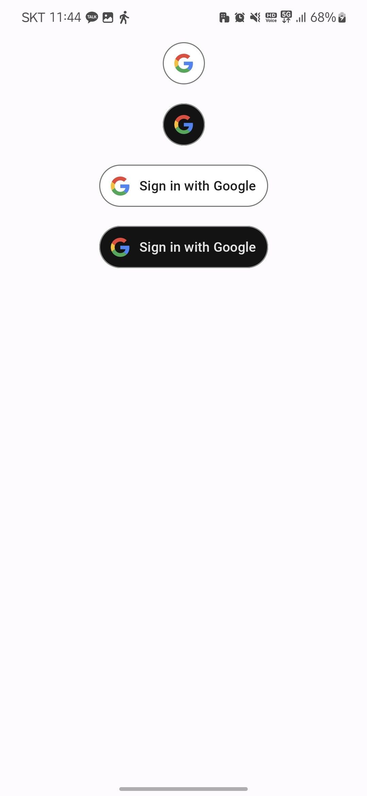
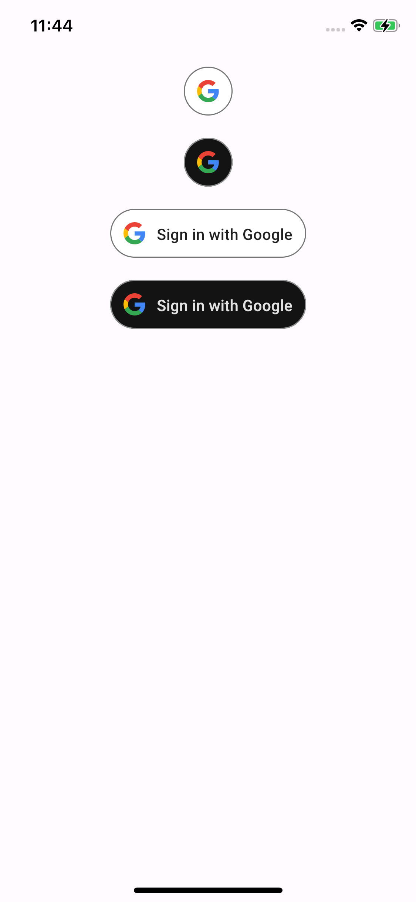
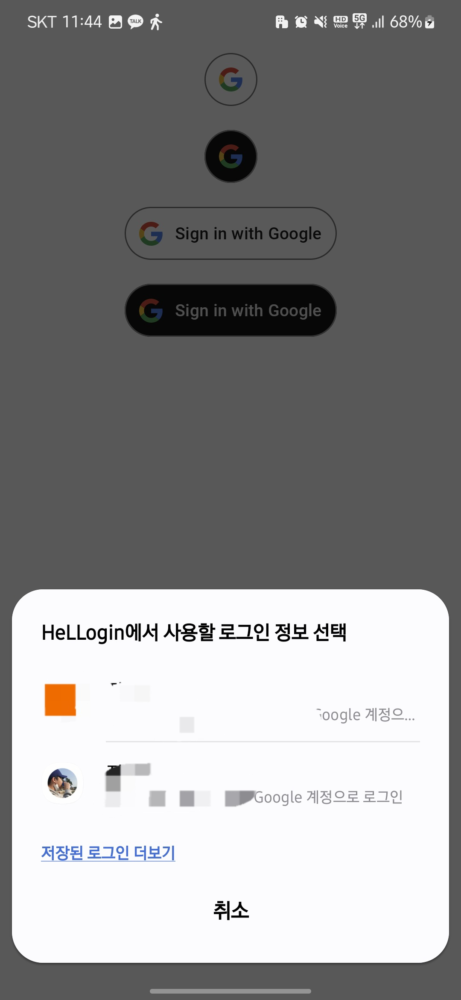
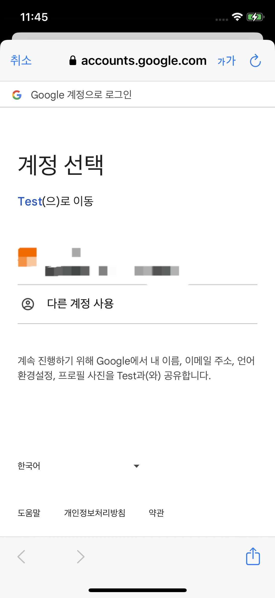

# Hellogin

This is Compose Multiplatform auth library

|              | Android                                            | IOS                                        |
|--------------|----------------------------------------------------|--------------------------------------------|
| google       |           |           |
| google-Login |  |  |

## Features

- ✅ Google Login

## To be added
- ❎ Apple Login
- ❎ Github Login

## Installation

HelLogin is available on Maven Central. In your root project `build.gradle.kts` file (
or `settings.gradle` file) add `mavenCentral()` to repositories.

```kotlin
repositories {
    mavenCentral()
}
```

Then in your shared module add desired dependencies in `commonMain`. Latest version: 

```kotlin
sourceSets {
    commonMain.dependencies {
        implementation(platform("io.github.jmseb3:hellogin-bom:<version>")) 
        
        implementation("io.github.jmseb3:hellogin-core") //core of library
        implementation("io.github.jmseb3:hellogin-google") //google login library

        implementation("io.github.jmseb3:hellogin-core-ui") //core of library for ui 
        implementation("io.github.jmseb3:hellogin-google-ui") //google login ui library

    }
}
```

or use toml

~~~toml
[versions]
hellogin = "x.y.z"

[libraries]
hellogin-bom = { module = "io.github.jmseb3:hellogin-bom", version.ref = "hellogin" }
hellogin-core = { module = "io.github.jmseb3:hellogin-core"}
hellogin-google = { module = "io.github.jmseb3:hellogin-google"}

hellogin-core-ui = { module = "io.github.jmseb3:hellogin-core-ui"}
hellogin-google-ui = { module = "io.github.jmseb3:hellogin-google-ui"}

[bundles]
hellogin = ["hellogin-core", "hellogin-google", "hellogin-core-ui", "hellogin-google-ui"]

~~~
```kotlin
sourceSets {
    commonMain.dependencies {
        implementation(platform(libs.plugin.hellogin.bom))
        implementation(libs.bundles.hellogin)
    }
}
```

-----

## How To Use

how to use this library

### Google

> don't forget [Google Api console setting](https://console.cloud.google.com/)!!

1. plz install first `GoogleOptionProvider`per platform

#### Android
~~~kotlin
class AppActivity : ComponentActivity(), OptionProviderAndroid {
    override fun onCreate(savedInstanceState: Bundle?) {
        super.onCreate(savedInstanceState)
        GoogleLoginHelper.setOptionProvider(this)
        enableEdgeToEdge()
        setContent { App() }
    }

    override fun provideGoogleIdOption(): GetGoogleIdOption {
        return GetGoogleIdOption.Builder()
            .setFilterByAuthorizedAccounts(false)
            .setServerClientId("WEB_CLIENT_ID")
            .build()
    }

    override fun provideContainer(): Container {
        return this
    }
}
~~~

> use `OptionProviderAndroid` because need [`GetGoogleIdOption`](https://developers.google.com/identity/android-credential-manager/android/reference/kotlin/com/google/android/libraries/identity/googleid/GetGoogleIdOption)

#### IOS
~~~kotlin
fun MainViewController(): UIViewController {
    val provider = object : GoogleOptionProvider {
        override fun provideContainer(): Container {
            val presentingViewController = ((UIApplication.sharedApplication().connectedScenes()
                .first() as? UIWindowScene)?.windows() as List<UIWindow?>).first()
                ?.rootViewController()!!
            return presentingViewController
        }
    }
    GoogleLoginHelper.setProvider(provider)
    return ComposeUIViewController { App() }
}
~~~
or
~~~kotlin
fun MainViewController(): UIViewController {
    GoogleLoginHelper.setDefaultOptionProvider()
    return ComposeUIViewController { App() }
}
~~~

> `setDefaultOptionProvider()` is Ios Only Function this provide Top ViewController

2. launch `GoogleLoginHelper`

#### No UI
~~~kotlin
   GoogleLoginHelper.requestLogin() //this is suspend function
~~~

> `requestLogin` need setting GoogleLoginHelper.setTokenHandler()

or

~~~kotlin
    GoogleLoginHelper.requestLoginWithTokenHandler(tokenHandler) //this is suspend function
~~~

#### Use UI
if use `io.github.jmseb3:hellogin-google-ui` , `GoogleLoginButton()`

~~~kotlin
    GoogleLoginButton() // button action is GoogleLoginHelper.requestLogin()
~~~

or

~~~kotlin
    GoogleLoginButton(tokenResultHandler = googleTokenHandler) // button action is GoogleLoginHelper.requestLoginWithTokenHandler()
~~~

3. you can receive result by `GoogleTokenHandler`, `onSuccess` or `onFail`

> use `GoogleResult.getTokenString()` get tokenString on Success
