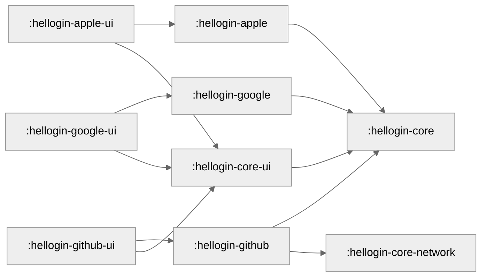

# Hellogin

This is Compose Multiplatform auth library

> This is Development!!

|              | Android            | IOS            |
|--------------|--------------------|----------------|
| google-Login |  |  |
| github-Login |  |  |
| apple-Login  |   |   |

## Features

- ✅ Google Login
- ✅ Github Login
- ✅ Apple Login

## To be added

- ❎ Naver Login

## Document 
See https://jmseb3.github.io/hellogin-doc/start.html

## Module Graph

```mermaid
%%{
  init: {
    'theme': 'neutral'
  }
}%%

graph LR
  :hellogin-core-ui --> :hellogin-core
  :hellogin-google --> :hellogin-core
  :hellogin-apple --> :hellogin-core
  :hellogin-apple-ui --> :hellogin-apple
  :hellogin-apple-ui --> :hellogin-core-ui
  :hellogin-github --> :hellogin-core
  :hellogin-github --> :hellogin-core-network
  :hellogin-google-ui --> :hellogin-google
  :hellogin-google-ui --> :hellogin-core-ui
  :hellogin-github-ui --> :hellogin-github
  :hellogin-github-ui --> :hellogin-core-ui
```